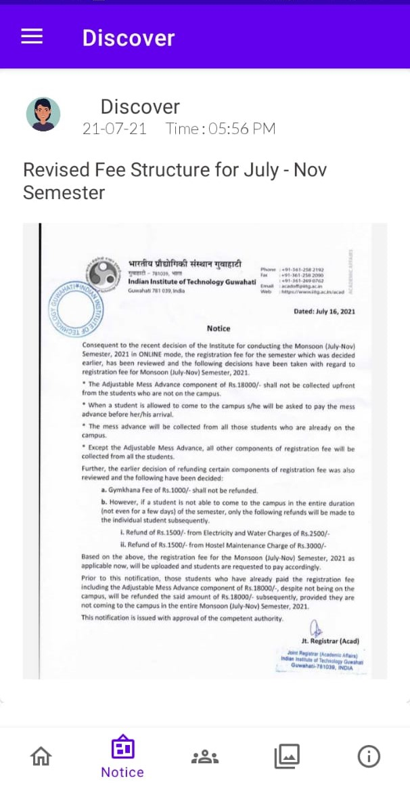
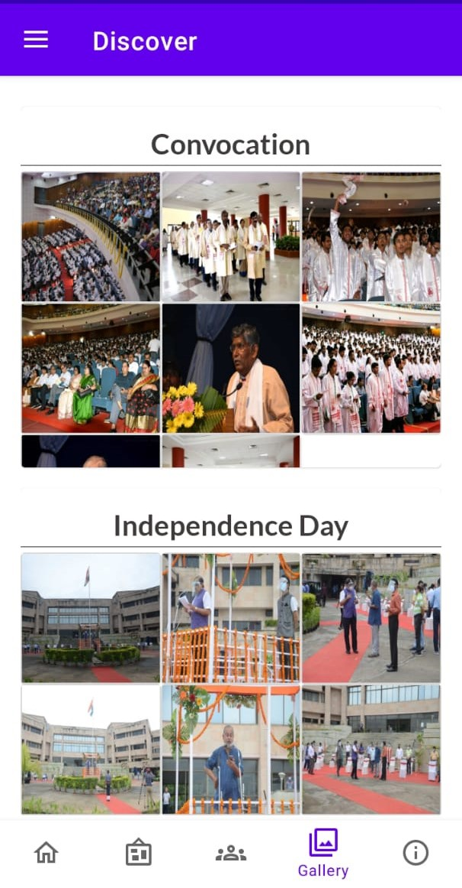
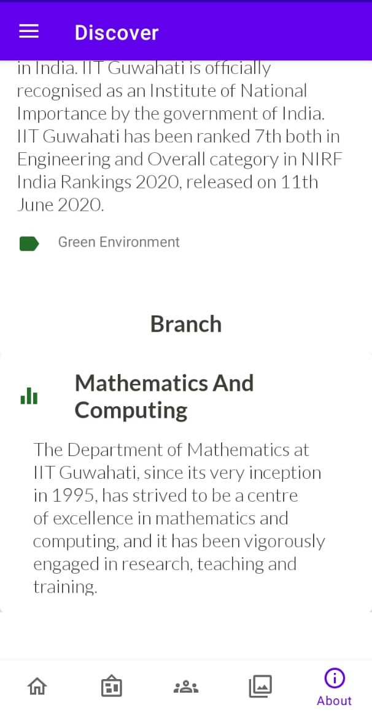
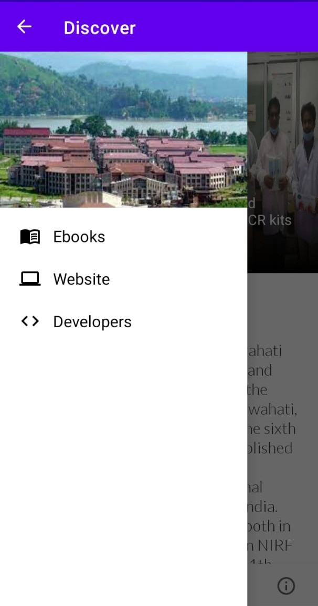

# Discover

## What is this?
An Android application facilitating as a college guide for IIT Guwahati.

It includes :
- A home screen that displays some of the background of IITG, a slider showing the latest developments around the institute, contact details and a Google Maps link to show the campus location.
- A Notice screen to display latest Notices issued by the Admin.
- A Faculty screen to display contact information and details of faculties of various departments.
- A Gallery that shows categorized images of events conducted at the institute.
- An About screen to show additional details.
- An Ebook section for course related notes and references.

An [Admin App](https://github.com/piyush-tiwari/DiscoverAppAdmin) creates and manipulates the retrieved data.

## What did we build this with?
We used Android Studio and Google's Firebase to build the app.

## Screenshots of App

  &nbsp; &nbsp; 

  &nbsp; &nbsp; 

  &nbsp; &nbsp; 

 

  &nbsp; &nbsp; 

  &nbsp; &nbsp; 

  &nbsp; &nbsp; 

 

## Dependencies used 
- [Android-Image-Slider](https://github.com/smarteist/Android-Image-Slider)
- [Glide](https://github.com/bumptech/glide)
- [CircleImageView](https://github.com/hdodenhof/CircleImageView)
- [PhotoView](https://github.com/Baseflow/PhotoView)
- [Android PdfViewer](https://github.com/barteksc/AndroidPdfViewer)
